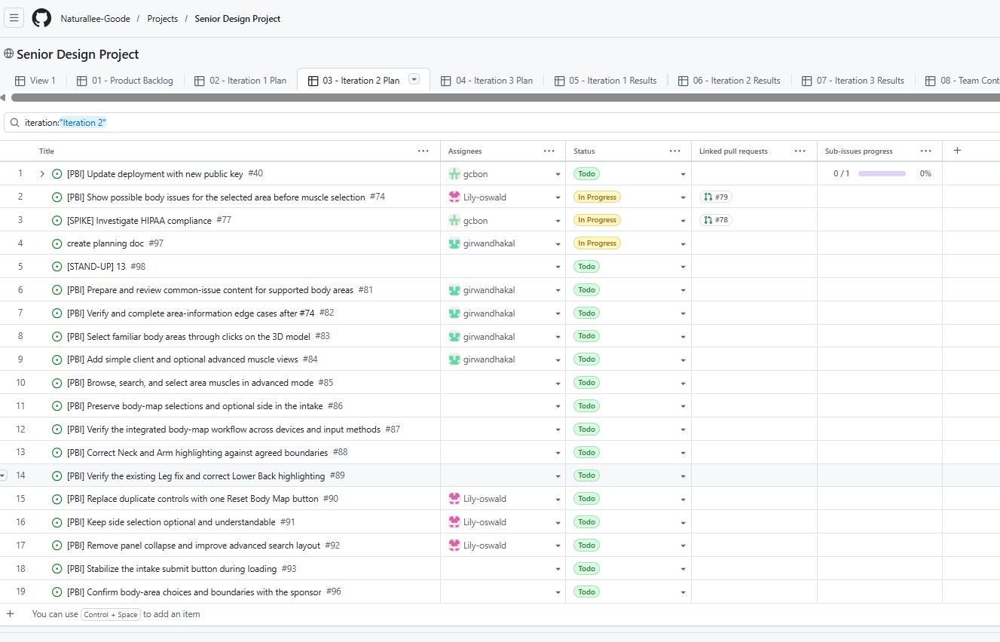

# Iteration 2 Planning

## Iteration Goal

We will make the pain assessment usable without anatomical knowledge: clients can select a familiar body area, read educational information about common issues, and continue through the intake without choosing a muscle or side. An optional advanced view will support Mia's educational conversations through muscle browsing and selection. We will make highlighting, reset, search layout, and submitted selection details consistent, verify the integrated flow on phones and desktops, and document the privacy and email-service decisions needed for deployment.

## Sponsor Planning Notes

### October 1 sponsor meeting

**Participants:** Mia Miller, Griffen Bon, Jay Roy, Lily Oswald, and Girwan Dhakal.

- **Simple client flow:** Mia explained that clients recognize areas such as shoulder, back, and knee but may not know muscle names. After viewing the demonstration, she accepted familiar area selection with optional muscle exploration. Her final clarification was that ordinary clients should not have to select a muscle.
- **Optional advanced view:** Mia accepted a regular view with an optional advanced mode for selecting specific muscles. She described muscle exploration as useful when she guides a client at a vendor event.
- **Area-level educational information:** Mia wanted common issues to appear when an area is selected, before a specific muscle is selected. She asked to replace diagnosis wording with headings such as “Common shoulder issues.” The information supports education and discussion.
- **Knee interaction:** Girwan exposed a mismatch between where a client might click around the knee and the model's individual anatomical structures. Mia discussed the inside, outside, and front of the knee. This informs area-click acceptance checks in #83 rather than requiring clients to identify a muscle.
- **Privacy and email delivery:** Griffen raised questions about the intake's handling of health-related information and third-party retention. The group discussed investigating EmailJS settings, alternatives, and whether information could avoid secondary storage. No legal applicability conclusion, service replacement, account upgrade, or production compliance claim was established in this meeting. These questions remain investigation work in #77 and #95.
- **Booking:** Mia reiterated that clients who already had a consultation should be able to reach other sessions rather than always being routed to a free call. She said payment is already set up in her calendar and did not request a new payment integration. She wanted to review the calendar before confirming the best route; the final event mapping was not settled in the transcript.

### October 5 team planning and walkthrough

**Participants recorded:** Girwan Dhakal, Griffen Bon, and Lily Oswald. Mia was not present; the decisions below are team decisions and proposals. Transcript references use elapsed time because the document header contains an inconsistent clock/timezone display.

- **Highlighting defects:** Lower Back highlighted abdominal geometry, and Leg highlighted wrist geometry. Lily reported an existing Leg fix awaiting PR review. Review and reuse that work before creating another implementation (#89).
- **Area boundaries:** The team proposed Upper Arm/Forearm and Thigh/Calf subdivisions and questioned Lower Back's size. Lily and Griffen recommended showing current areas and proposed alternatives to Mia first. The current twelve areas remain the working baseline until #96 records approved changes.
- **Reset:** The team agreed to remove duplicate selection controls while retaining one action that clears body-map choices and restores the full, forward-facing camera view (#90).
- **Search and layout:** Specific-muscle search belongs in advanced mode. Search results need readable placement near the input, and the unnecessary information-panel collapse control should be removed (#84, #85, #92). The discussion did not establish the leg result for a biceps search as a mapping defect; #85 addresses selected-area filtering.
- **Optional side:** Retain side as optional, including for central concerns. A missing side must not prevent area selection or intake submission (#91, #86).
- **Submit loading state:** The walkthrough identified a moving loading spinner; #93 covers a stable submission control, delayed requests, failure, and retry.
- **Existing webcam scans:** The team discussed their unclear purpose and settled on leaving them in place. Redesign or removal is outside the selected body-map work.

## Selected Work

Assignees below were verified against GitHub Issues on October 8, 2026. Issue #95 is closed and has no recorded assignee; its entry remains Unassigned.

| Issue | Planned outcome | Recorded assignee |
| --- | --- | --- |
| [#74](https://github.com/Naturallee-Goode/Paid-Pain-Assessment/issues/74) | Initial area-level common-issue information before muscle selection | Lily Oswald |
| [#81](https://github.com/Naturallee-Goode/Paid-Pain-Assessment/issues/81) | Prepare content for supported areas and record Mia's review | Girwan Dhakal |
| [#82](https://github.com/Naturallee-Goode/Paid-Pain-Assessment/issues/82) | Review #74 and complete missing-content, loading, and reset edge cases | Girwan Dhakal |
| [#83](https://github.com/Naturallee-Goode/Paid-Pain-Assessment/issues/83) | Interpret simple-mode model clicks as familiar area selections | Girwan Dhakal |
| [#84](https://github.com/Naturallee-Goode/Paid-Pain-Assessment/issues/84) | Separate simple client and optional advanced muscle views | Girwan Dhakal |
| [#85](https://github.com/Naturallee-Goode/Paid-Pain-Assessment/issues/85) | Browse, search, and select muscles within the selected area in advanced mode | Jay Roy |
| [#86](https://github.com/Naturallee-Goode/Paid-Pain-Assessment/issues/86) | Keep visible selections, confirmation, and intake payload consistent | Jay Roy |
| [#87](https://github.com/Naturallee-Goode/Paid-Pain-Assessment/issues/87) | Verify the integrated flow across devices and input methods | Jay Roy |
| [#88](https://github.com/Naturallee-Goode/Paid-Pain-Assessment/issues/88) | Reproduce and correct Neck/Arm highlighting against agreed boundaries | Jay Roy |
| [#89](https://github.com/Naturallee-Goode/Paid-Pain-Assessment/issues/89) | Verify the existing Leg fix and correct Lower Back highlighting | Lily Oswald |
| [#90](https://github.com/Naturallee-Goode/Paid-Pain-Assessment/issues/90) | Provide one Reset Body Map control for selection and camera recovery | Lily Oswald |
| [#91](https://github.com/Naturallee-Goode/Paid-Pain-Assessment/issues/91) | Make optional side selection understandable and consistent | Lily Oswald |
| [#92](https://github.com/Naturallee-Goode/Paid-Pain-Assessment/issues/92) | Remove panel collapse and improve advanced-search layout | Lily Oswald |
| [#93](https://github.com/Naturallee-Goode/Paid-Pain-Assessment/issues/93) | Stabilize the submit button and verify pending/failure/retry behavior | Griffen Bon |
| [#96](https://github.com/Naturallee-Goode/Paid-Pain-Assessment/issues/96) | Review an area/boundary worksheet with Mia and record decisions | Griffen Bon |
| [#77](https://github.com/Naturallee-Goode/Paid-Pain-Assessment/issues/77) | Investigate HIPAA applicability and document the decision | Griffen Bon |
| [#95](https://github.com/Naturallee-Goode/Paid-Pain-Assessment/issues/95) | Investigate necessary controls and cost-conscious changes | Unassigned |
| [#97](https://github.com/Naturallee-Goode/Paid-Pain-Assessment/issues/97) | Complete this planning record | Girwan Dhakal |

### Pending decisions and scope boundaries

- **Sponsor review:** Area subdivisions, exact boundaries, and final educational copy remain pending. Record approved, rejected, and unresolved options explicitly in #96 and #81.
- **Booking and production delivery:** The booking route remains a sponsor follow-up, and deployment/account access remains a dependency for live delivery testing. No new Calendly implementation Issue appears in the reviewed sprint Issue set; do not represent that implementation as a selected commitment until its scope and tracking are confirmed.
- **Deferred scope:** New payment processing, direct MedBridge integration, client accounts/databases, home exercise requests, QR-code delivery, and webcam redesign/removal are not selected commitments in this plan. The earlier Sprint 2 proposal is background, not evidence that these items were approved on October 1.
- **Capacity and ownership:** Owners are recorded for all selected open Issues as of October 8. Review workload and dependencies as assignments change. Capture any later additions, removals, or carried-forward work with rationale in the living Project and iteration review.

## Planning Snapshot

The screenshot below records the Senior Design Project's **Iteration 2 Plan** view on October 6, 2026, filtered to Iteration 2. It shows the selected Issues, recorded assignees, statuses, and linked pull requests at the time of capture.

The [Iteration 2 Plan](https://github.com/orgs/Naturallee-Goode/projects/1/views/4) view remains the living detailed plan as work progresses.

