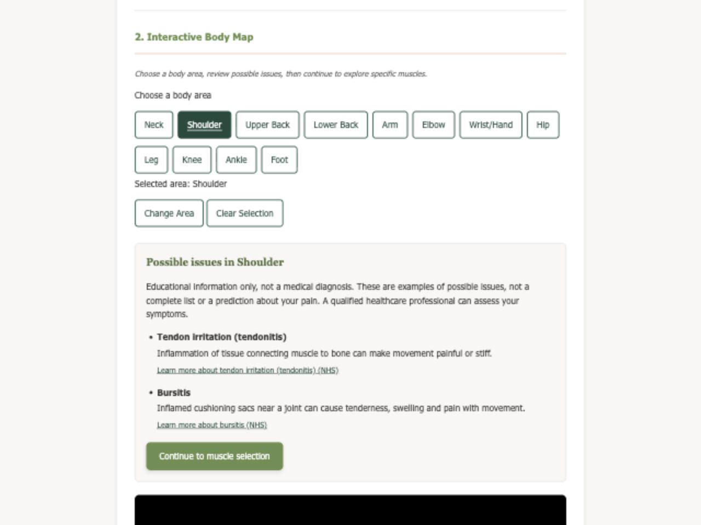
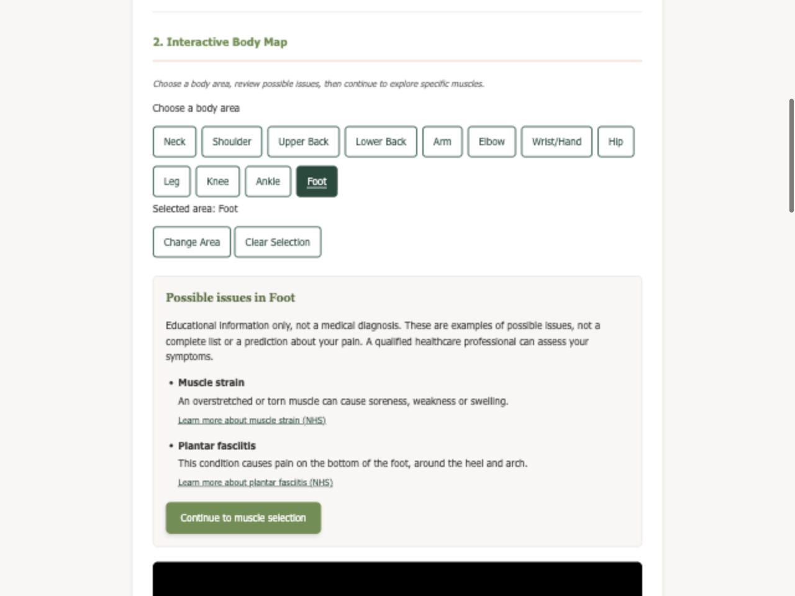

# Possible issues before muscle selection

PBI #74 adds an educational step between choosing an area and choosing a specific muscle. The list is informational: clients do not select an issue, and no issue is submitted as a diagnosis.

## Behavior

Choose one of the twelve area buttons. Its possible issues and short descriptions appear immediately, independently of model loading. Continue to muscle selection reveals the existing search and moves keyboard focus there. The information and disclaimer remain visible. Changing or clearing the area, or confirming a form reset, clears the review state and previous selection. A model click on a different supported area first opens that area's information without selecting the clicked muscle. After choosing an area, clicking a muscle in that area selects it immediately and displays a plain-text list of possible diagnoses for that area. Continue is only needed to reveal muscle search. The muscle list contains no web links and includes its own non-diagnosis disclaimer. Choosing Left or Right limits the highlight to that anatomical side. If a muscle is already selected, its name and diagnoses remain visible while the highlight switches to that muscle's requested side; Both highlights its paired copies.

`src/possible-issues-data.mjs` owns the area-to-issues mapping, separate from the muscle catalog. `src/possible-issues.mjs` renders it from the shared store. `issuesReviewed` records the user's Continue action for the current area only; it does not imply clinical review or diagnosis. Selecting a muscle remains optional.

## Content sources

Short descriptions were paraphrased from these NHS pages, checked September 30, 2026. Source URLs remain in the data and documentation for review, but the possible-issues UI does not display web links. These are illustrative examples, not an exhaustive list, probability ranking, or symptom assessment. No treatment recommendations or inferred diagnoses are generated. The sponsor has not yet reviewed this new copy.

- [Neck pain](https://www.nhs.uk/symptoms/neck-pain-and-stiff-neck/)
- [Sprains and strains](https://www.nhs.uk/conditions/sprains-and-strains/)
- [Tendonitis](https://www.nhs.uk/conditions/tendonitis/)
- [Bursitis](https://www.nhs.uk/conditions/bursitis/)
- [Joint pain](https://www.nhs.uk/symptoms/joint-pain/)
- [Carpal tunnel syndrome](https://www.nhs.uk/conditions/carpal-tunnel-syndrome/)
- [Ankle pain](https://www.nhs.uk/symptoms/foot-pain/ankle-pain/)
- [Plantar fasciitis](https://www.nhs.uk/conditions/plantar-fasciitis/)

## Verification

- `npm run test:body-map`: 37 passing tests, including all twelve area lists, link-free rendering, muscle-level diagnosis mappings, selected-muscle preservation during left/right/both filtering, review-state transitions, area replacement, clearing, form reset, and failed-catalog behavior.
- `npm run lint:html`: all three pages pass.
- Interactive browser verification: searching `deltoid` and selecting the result displays four possible shoulder diagnoses plus the non-diagnosis disclaimer, with no links in the selected-muscle panel. The area content and direct model-selection paths are covered by the automated browser suite.
- Desktop (1280px) and mobile (390px) inspected; mobile has no horizontal overflow.
- The extended `npm run test:browser` suite could not execute locally because the installed Playwright package does not have its matching Chromium runtime. Run it in CI before merging. The suite checks that direct muscle selection renders diagnoses and no diagnosis links, along with model-click state transitions, area replacement, and continued access to issues when the viewer is unavailable. Optional `EVIDENCE_DIR` saves screenshots during the browser run.

## Screenshots

## AI assistance

AI tools assisted with implementation, testing, documentation, and verification. Team review is still required.
